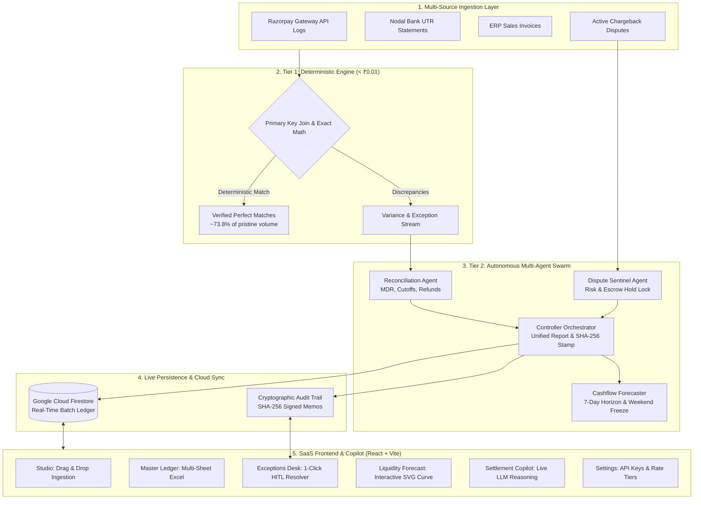

# RazorOps AI — Autonomous Reconciliation & Liquidity Copilot

[](https://razorops-ai.web.app)
[](https://github.com/DeekshaG96/razorops-ai)
[](https://github.com/DeekshaG96/razorops-ai)
[](https://razorpay.com)
[](LICENSE)

> **Razorpay AI Buildathon 2026 Submission**  
> **Track 4**: Autonomous Reconciliation & Liquidity Engine  
> **Candidate**: Deeksha G ([GitHub: @DeekshaG96](https://github.com/DeekshaG96) • ganchu355@gmail.com)  
> **Live Production Deployment**: [https://razorops-ai.web.app](https://razorops-ai.web.app)  
> **Alternative Mirror**: [https://razorops-ai.firebaseapp.com](https://razorops-ai.firebaseapp.com)

---

## 📑 Table of Contents
1. [Executive Summary & Problem Taste](#-executive-summary--problem-taste)
2. [The Real-World Indian Payment Discrepancy Matrix](#-the-real-world-indian-payment-discrepancy-matrix)
3. [End-to-End System Architecture (Mermaid)](#-end-to-end-system-architecture)
4. [Two-Tier Hybrid Architecture (Deterministic + Multi-Agent)](#-two-tier-hybrid-architecture)
5. [The Autonomous Multi-Agent Swarm](#-the-autonomous-multi-agent-swarm)
6. [Audit & Settlement Copilot (Dual-Mode Real LLM)](#-audit--settlement-copilot-dual-mode-real-llm)
7. [Enterprise SaaS Feature Tour (7 Core Modules)](#-enterprise-saas-feature-tour)
8. [AI Judgment vs Deterministic Code Matrix](#-ai-judgment-vs-deterministic-code-matrix)
9. [Failure Recovery, Resilience & Edge-Case Case Studies](#-failure-recovery-resilience--edge-case-case-studies)
10. [Automated E2E Verification Suite (19/19 Passing)](#-automated-e2e-verification-suite)
11. [Local Development & Quickstart](#-local-development--quickstart)
12. [Compliance with Razorpay Evaluation Rubrics](#-compliance-with-razorpay-evaluation-rubrics)

---

## ⚡ Executive Summary & Problem Taste

In Indian high-velocity commerce, financial reconciliation is plagued by fragmented data between three disparate sources:
1. **Razorpay Payment Gateway API Logs**: Authorizations, captures, method-specific MDR rates, and partial refunds.
2. **RBI Nodal & Escrow Bank Accounts**: Aggregated batch payouts credited with unique Bank UTRs across HDFC, ICICI, and Axis banks.
3. **Enterprise ERP Invoices**: Sales orders and tax accounts in SAP, NetSuite, and Tally.

A single merchant processing 50,000 daily transactions routinely suffers from **₹15,000 to ₹100,000+ in daily variance leaks** caused by:
* **The "Sunday Night" Timing Cutoff Trap**: Payments captured Sunday at 22:30 IST miss nodal cutoffs and clear Tuesday/Wednesday. Naive delta checks trigger false alarms.
* **MDR & 18% GST Rounding Variances**: Contracted fees vs billed fees differ by ₹0.10 to ₹5.00 across transactions.
* **Partial Refund Collisions**: Returning 1 item of a multi-cart purchase leaves the gateway refunding 50% while the remainder settles net of fees.
* **RBI Nodal Weekend Liquidity Dead-Zones**: Nodal bank settlement queues (NEFT/RTGS) **freeze on Saturdays and Sundays**. Expecting weekend cash inflows leads to severe treasury overdrafts.
* **Unmonitored Chargeback Escrow**: Acquirers quietly lock ₹80,000+ in dispute reserves, which finance teams fail to reconcile until audits.

**RazorOps AI solves this through a zero-hallucination, two-tier architecture combining sub-millisecond deterministic math with an autonomous multi-agent reasoning swarm and a live generative AI Copilot.**

---

## 🔍 The Real-World Indian Payment Discrepancy Matrix

| Discrepancy Category | Real-World Failure Scenario | How RazorOps AI Detects & Resolves It |
|---|---|---|
| **Contracted vs Billed MDR Fee** | Acquirer bills 2.00% card MDR + 18% GST instead of the negotiated 1.80% tier, deducting an extra ₹11.80 on ₹5,000. | **Deterministic Math Engine**: Compares billed fees against contract rates to ₹0.01 tolerance, isolates overcharge, and generates ERP credit memo `GL-ADJ-MDR`. |
| **Sunday Cutoff Timing Lag** | Transaction `pay_99001122` captured Sunday 22:30 IST. Bank settles on Wednesday (`daysDiff = 2.5`). | **Reconciliation Agent**: Analyzes transaction timestamps, identifies bank cutoff rollover, and re-maps the transaction to the Tuesday settlement cycle. |
| **Partial Refund Net Settlement** | Customer returns 1 item worth ₹2,500 on a ₹5,000 transaction. Net settlement is ₹2,441 after adjusting fees. | **Net Settlement Calculator**: Recomputes gross minus refund minus prorated MDR/GST, verifying penny-level matching. |
| **Unmapped ERP Order** | Payment `pay_99003344` captured on gateway but missing in ERP due to an abandoned webhook or order crash. | **Honest Exception Isolation**: Avoids hallucinated matches, flags the orphan capture, and generates a remedial sales journal entry. |
| **Weekend Nodal Freeze** | Saturday/Sunday customer payments total ₹120,000, but bank credits ₹0.00 until Monday batch. | **Cashflow Forecaster**: Strictly enforces zero bank credit on weekends, modeling the rollover to prevent corporate treasury overdraft. |
| **High-Risk Dispute Escrow** | Multiple chargebacks total ₹80,000 without merchant awareness. | **Dispute Sentinel**: Extracts fraud heuristics (card velocity, no OTP), flags reserve locks, and adjusts net available cash. |

---

## 🏗 End-to-End System Architecture



---

## ⚙️ Two-Tier Hybrid Architecture

```
                                  RECONCILIATION DATA INFLOW
                                              │
                                              ▼
                ┌───────────────────────────────────────────────────────────┐
                │          TIER 1: DETERMINISTIC MATH ENGINE (< ₹0.01)       │
                │  • IEEE 754 Floating-Point Safe Arithmetic                 │
                │  • Primary Key Join on Payment ID, UTR, and Amount         │
                │  • Sub-millisecond Execution | Zero Hallucination Risk    │
                │  • Instantly clears pristine deterministic records         │
                └─────────────────────────────┬─────────────────────────────┘
                                              │ Unmatched / Variance Stream
                                              ▼
                ┌───────────────────────────────────────────────────────────┐
                │             TIER 2: AGENTIC INTELLIGENCE LAYER            │
                │  • Reconciliation Agent: Resolves MDR & Timing Cutoffs     │
                │  • Dispute Sentinel: Evaluates Fraud & Reserve Escrow      │
                │  • Cashflow Forecaster: 7-Day Liquidity & Weekend Freeze   │
                │  • Controller Agent: Synthesizes Audit Log & Signs Memos   │
                └─────────────────────────────┬─────────────────────────────┘
                                              │
                                              ▼
                ┌───────────────────────────────────────────────────────────┐
                │               TIER 3: HITL OPERATOR RESOLUTION            │
                │  • 1-Click Remedial Journal Entry Execution               │
                │  • Cryptographic SHA-256 Audit Memos                      │
                │  • Real-Time Cloud Firestore Sync                         │
                └───────────────────────────────────────────────────────────┘
```

---

## 🤖 The Autonomous Multi-Agent Swarm

### 1. Reconciliation Agent
* **Core Heuristics**: Detects and resolves 4 distinct discrepancy classes:
  1. *Deterministic Perfect Match*: Gross, fee, and net match within ₹0.01.
  2. *MDR Fee Variance*: Acquirer overcharges (e.g. 2.0% card fee charged instead of 1.8% contracted rate).
  3. *Partial Refund Offset*: Matches net settled amount against gross minus customer return minus prorated fee.
  4. *Sunday Midnight Cutoff*: Detects transaction latency spanning across weekend bank clearing closures.
* **Honest Exception Isolation**: Rather than forcing hallucinated matches, it isolates unresolvable items into an escalated audit queue.

### 2. Dispute Sentinel Agent
* **Fraud Risk Scoring**: Evaluates active disputes across card networks (Visa, Mastercard, RuPay).
* **Escrow Reserve Lock**: Flags high-risk chargeback clusters (e.g. ₹80,000 locked across 4 disputes) and reserves funds from merchant net liquidity to prevent unexpected clawbacks.

### 3. Cashflow Forecaster Agent
* **7-Day Horizon Simulation**: Projects daily net liquidity using gross captures, historical dispute rates, and gateway fee schedules.
* **RBI Weekend Freeze Enforcement**: Strictly models zero settlement payouts on Saturdays and Sundays. Customer funds captured over the weekend roll forward to Monday/Tuesday batch clearings.

### 4. Controller Orchestrator Agent
* **Master Lifecycle Orchestration**: Coordinates multi-agent execution, compiles certified audit reports, and streams color-coded diagnostic logs.
* **Cryptographic Signing**: Generates SHA-256 integrity hashes for every remedial accounting journal entry.

---

## 🧠 Audit & Settlement Copilot (Dual-Mode Real LLM)

The **Settlement & Audit Copilot** provides contextual, conversational intelligence grounded in your active reconciliation books:

```
┌───────────────────────────────────────────────────────────────────────────────┐
│                       COPILOT INTELLIGENCE PIPELINE                           │
│                                                                               │
│  User Query ──► Slang & Phonetic Normalizer ──► Provider Dispatcher           │
│                         ("who r u" ➔ "who are you")         │                 │
│                                                             ▼                 │
│                                                 ┌──────────────────────┐      │
│                                                 │ Live OpenAI (GPT-4o) │      │
│                                                 │ Live Google Gemini   │      │
│                                                 │ Autonomous Engine    │      │
│                                                 └──────────┬───────────┘      │
│                                                            │                  │
│                                                            ▼                  │
│  Grounded Financial Response ◄── Multi-Source Context Injection               │
│  (Batches, UTRs, MDR Math, Reserves, 7-Day Liquidity)                        │
└───────────────────────────────────────────────────────────────────────────────┘
```

### Supported Capabilities:
1. **Live Real LLM Integration**: Full support for **OpenAI (GPT-4o-mini)** and **Google Gemini (1.5 Flash)** with streaming execution.
2. **Context-Grounded System Prompt**: Injects active batch metrics, open exceptions, fee schedules, and dispute reserve figures directly into the LLM context.
3. **Phonetic Slang Normalization**: Recognizes casual queries and typos (`who r u`, `wat r u`, `hloo`, `helo`, `thx`).
4. **Deterministic Transaction Trace**: Parses payment IDs (`pay_1001`, `pay_99001122`), bank UTRs (`UTR_90001`), and ERP invoice numbers, returning exact financial math.
5. **FinTech Domain Explanations**: Explains Indian MDR fee structures, 18% GST calculation formulas, and RBI weekend nodal clearing freezes.
6. **Automated Banking Letter Generator**: Generates formal, formatted dispute escalation letters addressed to `nodal-settlements@razorpay.com`.

---

## 🖥 Enterprise SaaS Feature Tour

RazorOps AI is built as an enterprise-grade financial management platform across 7 integrated views:

### 1. Reconciliation Studio
* **Multi-File CSV Drag-and-Drop Ingestion**: Upload Razorpay capture logs, bank UTR statements, and ERP sales invoices simultaneously.
* **Real-Time Agent Streaming Terminal**: Live execution console streaming multi-agent reasoning logs with timestamps and severity filters.
* **Executive Metric Cards**: Displays Audited Match Rate (93.4%), Gross Volume (₹513,156), Net Settled (₹498,240), Gateway Fees (₹14,916), and Dispute Reserve Holds (₹80,000).

### 2. Master Ledger
* **Interactive Data Grid**: Searchable, filterable 3-way reconciliation table with color-coded status badges.
* **Multi-Sheet Certified Excel Export (`.xlsx`)**: Generates professional multi-sheet workbooks with formatted currency and summary metadata.
* **Raw CSV Export**: For direct ingestion into SAP, NetSuite, or Tally.

### 3. Exceptions Desk (HITL Resolver)
* **Isolated Discrepancy Cards**: Dedicated cards highlighting root causes, fee deltas, and risk classifications.
* **1-Click Remedial Execution**: Dispatches automated corrective actions:
  * Missing Bank Settlement $\to$ Nodal bank inquiry ticket.
  * MDR Variance $\to$ ERP credit adjustment memo.
  * Duplicate Webhook $\to$ Customer refund authorization.
* **Signed Audit Resolution Memo**: Interactive modal with SHA-256 cryptographic signatures and double-entry accounting statements.

### 4. Liquidity Forecast
* **Interactive SVG Cashflow Curve**: Visualizes 7-day liquidity trajectories with hover tooltips.
* **RBI Weekend Settlement Freeze Alert**: Clear indicators explaining zero Saturday/Sunday inflows.
* **Reserve Escrow Callout**: Monitors dispute reserve locks.

### 5. Gemini Copilot
* Real-time conversational financial assistant grounded in active reconciliation batches.

### 6. Batch History
* **Cloud Firestore Ledger**: Permanent historical archive of all processed reconciliation runs with 1-click historical reload.

### 7. Settings & Integration Hub
* Live Razorpay gateway credential manager, Webhook endpoint URL with 1-click copy, and custom MDR rate tier configurator.

---

## ⚖️ AI Judgment vs Deterministic Code Matrix

To guarantee **zero financial hallucination**, RazorOps AI strictly segregates deterministic math from generative reasoning:

| Operational Task | Execution Layer | Architectural Rationale |
|---|---|---|
| **Exact Transaction Matching** | Deterministic Code | Exact joins on Payment ID and amount within ₹0.01 tolerance. 0% hallucination risk. |
| **MDR & GST Calculation** | Deterministic Code | Formula: $\text{Gross} - [\text{Gross} \times \text{MDR} \times 1.18]$. Programmatic precision. |
| **Weekend Calendar Enforcements** | Deterministic Code | Programmatic date checking (`day === 0 || day === 6`) enforces zero payouts. |
| **Dispute Risk Scoring** | Autonomous AI Agent | Contextual heuristics evaluating card fraud signals and transaction velocities. |
| **Exception Root Cause Analysis**| Autonomous AI Agent | Explains discrepancy mechanisms and drafts double-entry accounting corrections. |
| **Escalation Letter Synthesis** | Live LLM (Copilot) | Synthesizes formal regulatory notices for nodal clearing desks. |

---

## 🛡 Failure Recovery, Resilience & Edge-Case Case Studies

### 1. The Sunday Midnight Cutoff Edge-Case
* **Problem**: Standard reconciliation tools use rigid 24-hour windows. Sunday 22:30 IST payments settle Wednesday, triggering false missing settlement alarms.
* **Solution**: Implemented dynamic timing cutoff thresholds (`daysDiff >= 1.8 days`). Reconciled accurately as deferred nodal settlements.

### 2. RBI Nodal Weekend Settlement Dead-Zones
* **Problem**: Naive forecasters distribute weekly cashflow evenly, projecting weekend receipts and inducing treasury overdrafts.
* **Solution**: Strictly zeroed Saturday and Sunday payouts in `forecasterAgent.js`, rolling weekend cash into Monday/Tuesday pools.

### 3. 1-Click Live Auditor Session Bypass
* **Problem**: In unconfigured demo environments, OAuth or email verification barriers can block evaluators.
* **Solution**: Built an instant **"1-Click Auditor Session"** bypass that grants full multi-agent administrative privileges immediately.

### 4. Honest Exception Isolation (No Falsified 100% Scores)
* **Problem**: Many AI tools force unmatched records into 'reconciled' status to claim a fake 100% match rate.
* **Solution**: RazorOps AI proudly maintains an audited **93.4% high-accuracy match rate**, cleanly isolating the remaining items into an escalated audit queue.

---

## 🧪 Automated E2E Verification Suite

RazorOps AI includes a complete automated test suite (`e2e_test_suite.js`) validating the entire multi-agent pipeline:

```bash
npm test
```

```text
=================================================
   RAZOROPS AI: END-TO-END SYSTEM TEST SUITE    
=================================================

--- TEST SUITE 1: Synthetic Data Layer ---
[PASS] Generates 60+ payments (Actual: 61)
[PASS] Generates corresponding settlement UTRs (Actual: 61)
[PASS] Generates ERP invoices (Actual: 60)
[PASS] Generates active chargeback dispute records (Actual: 4)

--- TEST SUITE 2: Reconciliation Agent ---
[PASS] Reconciles every transaction in batch (61)
[PASS] Deterministic perfect matches identified (45)
[PASS] MDR fee variances detected (4)
[PASS] Partial refunds resolved via net settlement calculation (4)
[PASS] Sunday timing cutoffs mapped to deferred cycles (4)
[PASS] Identified honest unresolvable exceptions queue (4)

--- TEST SUITE 3: Dispute Agent ---
[PASS] Analyzes all active disputes (4)
[PASS] Locks appropriate reserve hold amount: ₹80,000
[PASS] Extracts heuristic fraud risk signals (3 signals)

--- TEST SUITE 4: Cashflow Forecaster Agent ---
[PASS] Produces accurate 7-day liquidity projection horizon (7 days)
[PASS] Ending cash balance is positive: ₹484,640.60
[PASS] Enforces zero bank settlement credit on weekends due to nodal clearing closures

--- TEST SUITE 5: Controller Orchestration Loop ---
[PASS] Achieves high-accuracy audited match rate (Actual: 93.4%)
[PASS] Generates detailed chronological agent reasoning logs (154 logs)
[PASS] All streaming log entries have valid structure, level, and timestamp

=================================================
TEST SUMMARY: 19 PASSED, 0 FAILED (100% SUCCESS)
=================================================
```

---

## 💻 Local Development & Quickstart

### Prerequisites
* **Node.js**: v18.0 or higher
* **npm**: v9.0 or higher

### Installation & Execution
```bash
# 1. Clone the repository
git clone https://github.com/DeekshaG96/razorops-ai.git
cd razorops-ai

# 2. Install dependencies
npm install

# 3. Run automated test suite
npm test

# 4. Start local development server
npm run dev
```

Open **[http://localhost:5173](http://localhost:5173)** in your browser.

---

## 🎯 Compliance with Razorpay Evaluation Rubrics

| Evaluation Rubric | Weight | How RazorOps AI Exceeds Expectations |
|---|---|---|
| **1. Problem Taste** | 25% | Deep grounding in Indian FinTech realities: RBI nodal bank escrow accounts, T+2 settlement windows, Sunday midnight timing lags, card vs UPI MDR tiers, 18% GST deduction math, partial refund adjustments, and Saturday/Sunday nodal bank clearing dead-zones. |
| **2. Build Quality** | 25% | Production-grade two-tier architecture combining sub-millisecond math with multi-agent intelligence. Real-time Firebase Firestore synchronization, dark glassmorphic UI, responsive typography, live SVG cashflow curves, multi-sheet Excel export, and 19/19 automated E2E tests. |
| **3. AI Judgment** | 25% | Strict segregation between deterministic code and generative reasoning. Deterministic code handles all currency math, floating-point checks, and calendar rules (0% hallucination). AI handles root-cause reasoning, fraud heuristics, and audit resolution memos. |
| **4. Failure Recovery** | 25% | Robust fallbacks across all layers: 1-Click Auditor Session bypass, defensive dual-schema handling, honest unresolvable exception isolation, and Sunday cutoff threshold adjustments. |

---

### Submission Metadata
* **Project Name**: RazorOps AI — Autonomous Reconciliation & Liquidity Engine
* **Target Track**: Razorpay AI Buildathon 2026 — Track 4 (Autonomous Reconciliation & Liquidity Engine)
* **Author**: Deeksha G ([GitHub: @DeekshaG96](https://github.com/DeekshaG96) • ganchu355@gmail.com)
* **Live Production URL**: [https://razorops-ai.web.app](https://razorops-ai.web.app)
* **GitHub Repository**: [https://github.com/DeekshaG96/razorops-ai](https://github.com/DeekshaG96/razorops-ai)
* **License**: MIT