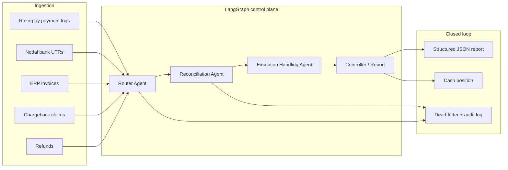

# RazorOps AI — Phase 1 Architecture

**Track:** AI Finance Controller (books + cash position)  
**Product:** Multi-agent dispute and cashflow reconciliation  
**Constraint:** Batch ≥50 synthetic records, close the finance-ops loop, emit match rate + honest unresolved exceptions.

This document is the Phase 1 contract. Agent code (Phase 2) and the dashboard (Phase 3) must implement this design, not invent a parallel one.

---

## 1. Problem taste (why this system exists)

Merchant finance ops at a payments company does not fail on “can we join two IDs?” It fails on **fragmented truth**:

| Source | What it claims | Typical lie |
|---|---|---|
| Razorpay PG logs | Capture/refund facts | Status lags refunds; method-specific MDR |
| Nodal bank UTRs | Cash that actually moved | Batch/split credits, late cutoff cycles |
| ERP invoices | Books (revenue recognition) | Amounts include tax, missing links, double-clicks |
| Chargeback claims | Contested cash | Hold before UTR, or clawback after settlement |

Deterministic matching is the backbone. An LLM is only useful when IDs agree but **economic meaning** does not (MDR 2.0% vs 1.8%, partial refund vs split UTR, T+2 vs late Sunday cutoff).

---

## 2. System context



**Cash position (ops definition for this prototype):**

`available_cash_paise = sum(settled net UTR credits) − sum(refunds already netted in those UTRs) − sum(chargeback holds)`

Books (ERP) and cash (UTR) are allowed to diverge; the dashboard must show both, not pretend they are the same number.

---

## 3. Agent contracts

### 3.1 Router Agent

**Job:** Classify each ingest row into a canonical event type and attach a routing hint. No matching.

| Input | Output |
|---|---|
| Raw CSV/JSON row + filename/source tag | `event_type`, `confidence`, `canonical_id_guess`, `needs_human_parse` |

**Deterministic first:** if `source_system` is present and valid, skip the LLM.  
**LLM reserved for:** unlabeled dumps, OCR-ish bank narrations, mixed columns (`payment_id` vs `pay_id` vs `Razorpay Txn`).

**Failure recovery:** unparseable rows go to DLQ with the original payload; batch continues.

### 3.2 Reconciliation Agent

**Job:** Build a payment-centric match set: PG + refunds + UTR legs + ERP + chargebacks.

| Layer | Method | When |
|---|---|---|
| Exact ID | Code (`payment_id`, `order_id`, `utr`, `invoice_id`) | Always first |
| Amount identity | Integer paise equality | After ID join |
| Fuzzy / narrative | LLM | Same merchant + close amount + broken ID, or split UTR vs partial refund ambiguity |

**Hard rule:** never let the LLM override a perfect ID+amount match. Never let the LLM “close” a case with missing UTR.

### 3.3 Exception Handling Agent

**Job:** Label discrepancies with a **stable exception code**, severity, suggested owner, and whether auto-close is allowed.

Seed taxonomy (Phase 2 must emit these codes):

| Code | Meaning | Typical auto-close? |
|---|---|---|
| `MATCHED` | Books, PG, and cash agree within policy | Yes |
| `PARTIAL_REFUND` | Net cash < capture; refund ledger explains it | Policy: yes if refund_id exists |
| `MDR_VARIANCE` | Expected MDR+GST ≠ bank fee | No — pricing/ops review |
| `TIMING_CUTOFF` | Settlement cycle slipped past 23:00 IST cutoff | Yes if T+N policy holds |
| `SPLIT_SETTLEMENT` | One capture, multiple UTR legs summing to net | Yes if sum(legs) == expected net |
| `CHARGEBACK_HOLD` | Dispute filed; cash withheld or clawed | No — risk |
| `MISSING_UTR` | Captured, no bank credit | No |
| `ERP_AMOUNT_MISMATCH` | Invoice ≠ capture | No |
| `DUPLICATE_CAPTURE` | Two `pay_*` for one `order_id` / one invoice | No |
| `DUPLICATE_UTR` | Two credits for one capture (not a legitimate split) | No |

Honest exceptions: if a refund *almost* explains a gap but GST/MDR rounding disagrees, **do not** auto-match. Emit `MDR_VARIANCE` or a compound note.

### 3.4 Controller (orchestration, not a fourth “personality”)

LangGraph graph: `route → reconcile → except → report`.  
Retries: per-node, max 2, exponential backoff. Graph-level timeout. Idempotent node keys = `batch_id + payment_id`.

---

## 4. AI judgment (what the LLM is *not* for)

| Use code | Use LLM |
|---|---|
| `pay_` / `UTR` / `INV` joins | Bank narration: “NEFT RAZORPAY SETT 12AUG BATCH” |
| MDR = round(gross × rate) + GST 18% | “Is 20 bps variance a pricing bug or a promo MID?” |
| Cutoff: capture ≥ 23:00 IST → next cycle | Ambiguous split vs partial refund when both exist |
| Match rate = matched / processed | Draft exception summary for a human ops queue |

Phase 2 report schema (locked now so data gen can label ground truth):

```json
{
  "batch_id": "string",
  "total_processed": 0,
  "matched_count": 0,
  "match_rate_pct": 0.0,
  "cash_position_paise": 0,
  "erp_books_paise": 0,
  "exceptions": [
    {
      "payment_id": "pay_...",
      "code": "MDR_VARIANCE",
      "severity": "medium",
      "expected_paise": 0,
      "actual_paise": 0,
      "delta_paise": 0,
      "summary": "string",
      "auto_closed": false
    }
  ],
  "dlq": []
}
```

**Match rate definition:** `matched_count / total_processed` where `total_processed` = distinct `payment_id`s in the PG extract for the batch. Partial refunds that fully reconcile to refund + UTR count as **matched** (loop closed). MDR variance, missing UTR, chargeback holds, ERP mismatch, duplicates count as **unresolved exceptions**. Timing cutoffs that still cash-settle correctly count as **matched** with a non-blocking note (ops cares about cash, not the calendar). Split settlements that sum correctly count as **matched**.

Ground-truth file `labels.csv` encodes this policy so Phase 2 can be scored without theatre.

---

## 5. Data plane (Phase 1 artifacts)

Generated under `backend/data/generated/` (seed `42`):

| File | Grain | Role |
|---|---|---|
| `payments.csv` | One Razorpay capture | Source of truth for “what was sold” |
| `refunds.csv` | Refund legs | Explains partial net |
| `settlement_legs.csv` | One UTR credit (may be split) | Cash that moved |
| `erp_invoices.csv` | Merchant books | Revenue/AR |
| `chargebacks.csv` | Dispute claims | Holds / clawbacks |
| `ingest_events.csv` | Union of the above with `source_system` | Router input |
| `labels.csv` | One row per `payment_id` | Evaluation only — **not** an agent input |
| `manifest.json` | Batch metadata | Counts, seed, policy |

Money is **integer paise** on disk. No float INR in the matching path.

---

## 6. Failure recovery (production-shaped, even in a prototype)

1. **Continue-on-row-error:** one bad CSV row never aborts the batch.  
2. **DLQ:** original row + exception class + traceback snippet.  
3. **Idempotency:** rerunning the same `batch_id` overwrites report, does not double-count cash.  
4. **Audit log:** JSONL, one line per agent decision.  
5. **Kill switch:** if match rate is 100% on a known-messy batch, the controller must fail the run (the dataset is *designed* to leave exceptions).  
6. **Secrets:** LLM keys from env only; never in CSVs.

---

## 7. Target deployment (AWS / GCP — not required to run locally)

| Concern | AWS | GCP |
|---|---|---|
| Batch trigger | EventBridge + Step Functions | Cloud Scheduler + Workflows |
| Compute | ECS Fargate / Lambda (15m cap) | Cloud Run Jobs |
| Object store for CSVs | S3 | GCS |
| Orchestration state | Step Functions / DynamoDB | Firestore / Workflows |
| LLM | Bedrock (or OpenAI via VPC) | Vertex AI |
| Secrets | Secrets Manager | Secret Manager |
| Observability | CloudWatch + structured JSON logs | Cloud Logging |

Local prototype: Python engine writes `backend/data/generated/report.json`; Vite dashboard reads it in Phase 3.

---

## 8. Phase boundary

**Phase 1 (this folder):** architecture + synthetic generator + labeled CSVs.  
**Phase 2:** LangGraph engine, deterministic matcher, LLM only on fuzzy/exception reasoning, JSON report.  
**Phase 3:** React dashboard (cash, match rate, exception table).  
**Phase 4:** README, form answers, pitch script.

Do not implement Phase 2 until explicitly told to proceed.
